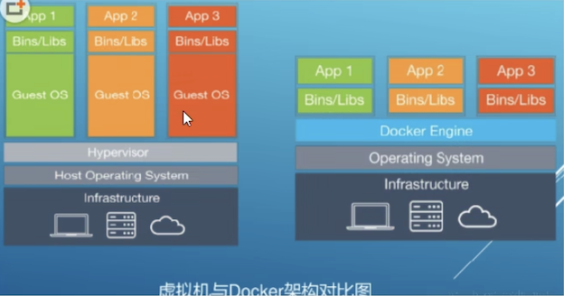

Docker是软件级别的虚拟机，Docker是内核级虚拟化，其不像传统的虚拟化技术一样需要额外的Hypervisor支持，所以在一台物理机上可以运行很多个容器实例，可大大提高物理服务器的CPU和内存的利用率。

[Docker官网](https://docs.docker.com)
[Docker Hub](https://hub.docker.com)

>容器与虚拟机的区别

- 传统虚拟机技术是虚拟出一套硬件后，在其上运行一个完整的操作系统，在该系统上再运行所需应用进程。
- 容器内的应用进程直接运行于宿主机的内核，容器没有自己的内核而且没有进行硬件模拟。因此，容器比传统虚拟机更为轻便。
- 每个容器之间相互隔离，每个容器有自己的文件系统，容器之间的进程不会相互影响，能区分计算资源。

## 一、Docker基本组成

docker主要由镜像，容器，仓库三要素组成。

**镜像（image）**

Docker镜像就是一个只读的模版。镜像可以用来创建Docker容器，一个镜像可以创建很多容器。
它也相当于是一个root文件系统。比如官方镜像centos:7就包含了完整的一套centos:7最小系统的root文件系统。
相当于容器的源代码，Docker镜像文件类似于Java的类模版，而Docker容器实例类似于Java中new出来的类的实例对象。

**容器（container）**

- 从面向对象角度 

Docker利用容器独立运行的一个或一组应用，应用程序或服务运行在容器里，容器就类似于一个虚拟化的运行环境，容器是用镜像创建的运行实例。就像Java中的类和实例对象一样，镜像是静态的定义，容器是镜像运行时的实体。容器为镜像提供一个标准和隔离的运行环境，它可以被启动、开始、停止、删除。每个容器都是相互隔离的、保证安全的平台。

- 从镜像容器角度

可以把容器看作是一个简易版的Linux环境（包括root用户权限、进程空间、用户空间和网络空间等）和运行在其中的应用程序。
​	
**仓库（repository）**

仓库是集中存放镜像文件的场所。仓库分为公开仓库（public）和私有仓库（private）两种形式。最大的公开仓库是Docker Hub，存放了数量庞大的镜像供用户下载。

## 二、Docker基本原理

Docker并非是一个通用的容器工具，它依赖于已存在并运行的的Linux内核环境。Docker实质上是在已经运行的Linux下制造了一个隔离的文件环境，因此它的执行效率几乎等同于所部署的Linux主机。
因此，**Docker必须部署在Linux内核的系统上，如果其他系统想部署Docker就必须安装一个虚拟Linux环境。**

**docker 为什么比虚拟机快**

1. docker有着比虚拟机更少的抽象层
2. docker利用的是宿主机的内核，而不需要加载操作系统os内核

Hypervisor：允许多个操作系统共享一个CPU，是虚拟化技术，目的是共享硬件资源。一种运行在基础物理服务器和操作系统之间的中间软件层,可允许多个操作系统和应用共享硬件。

## 三、Docker常用命令

启动/停止/重启/查看/开机启动docker：systemctl start/stop/restart/status/enable docker
查看docker信息：docker info
查看docker帮助：docker --help；  docker [命令] --help 

### 镜像命令

docker images：列出本机上的所有镜像
docker search [image]：查找镜像
docker pull [image]：拉取镜像
docker system df：查看docker镜像容器所占空间
docker rmi [image]：删除镜像
docker run [image] 运行一个镜像；如果本机没有，则去镜像仓库拉取，类似于maven
docker [命令] --help：查看命令详细信息参数

### 容器命令

docker ps 查看当前运行的容器。参数 [-a] 查看运行的所有容器

