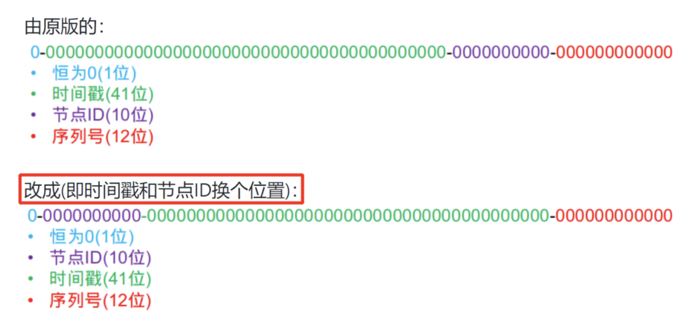

官网解释：http://seata.io/zh-cn/blog/seata-snowflake-explain.html

博客地址：https://mp.weixin.qq.com/s/SaS1fDjilhpktN0m31eFug

## 构成



与雪花算法的不同之处：

* 不再每次都获取时间戳，只有当每毫秒自增超过4096个ID，也就是用满了之后，才会将毫秒数加一。
* 每个节点的子序列是单调递增的。
* 每个节点id是单调递增的，所以总体还是单调递增。

```java
package demo;

/*
 *  Copyright 1999-2019 Seata.io Group.
 *
 *  Licensed under the Apache License, Version 2.0 (the "License");
 *  you may not use this file except in compliance with the License.
 *  You may obtain a copy of the License at
 *
 *       http://www.apache.org/licenses/LICENSE-2.0
 *
 *  Unless required by applicable law or agreed to in writing, software
 *  distributed under the License is distributed on an "AS IS" BASIS,
 *  WITHOUT WARRANTIES OR CONDITIONS OF ANY KIND, either express or implied.
 *  See the License for the specific language governing permissions and
 *  limitations under the License.
 */

import java.net.NetworkInterface;
import java.util.Enumeration;
import java.util.Random;
import java.util.concurrent.atomic.AtomicLong;

/**
 * @author funkye
 * @author selfishlover
 */
public class IdWorker {

    /**
     * Start time cut (2020-05-03)
     */
    private final long twepoch = 1588435200000L;

    /**
     * The number of bits occupied by workerId
     */
    private final int workerIdBits = 10;

    /**
     * The number of bits occupied by timestamp
     */
    private final int timestampBits = 41;

    /**
     * The number of bits occupied by sequence
     */
    private final int sequenceBits = 12;

    /**
     * Maximum supported machine id, the result is 1023
     */
    private final int maxWorkerId = ~(-1 << workerIdBits);

    /**
     * business meaning: machine ID (0 ~ 1023)
     * actual layout in memory:
     * highest 1 bit: 0
     * middle 10 bit: workerId
     * lowest 53 bit: all 0
     */
    private long workerId;

    /**
     * timestamp and sequence mix in one Long
     * highest 11 bit: not used
     * middle  41 bit: timestamp
     * lowest  12 bit: sequence
     */
    private AtomicLong timestampAndSequence;

    /**
     * mask that help to extract timestamp and sequence from a long
     */
    private final long timestampAndSequenceMask = ~(-1L << (timestampBits + sequenceBits));

    /**
     * instantiate an IdWorker using given workerId
     * @param workerId if null, then will auto assign one
     */
    public IdWorker(Long workerId) {
        initTimestampAndSequence();
        initWorkerId(workerId);
    }

    /**
     * init first timestamp and sequence immediately
     */
    private void initTimestampAndSequence() {
        long timestamp = getNewestTimestamp();
        long timestampWithSequence = timestamp << sequenceBits;
        this.timestampAndSequence = new AtomicLong(timestampWithSequence);
    }

    /**
     * init workerId
     * @param workerId if null, then auto generate one
     */
    private void initWorkerId(Long workerId) {
        if (workerId == null) {
            workerId = generateWorkerId();
        }
        if (workerId > maxWorkerId || workerId < 0) {
            String message = String.format("worker Id can't be greater than %d or less than 0", maxWorkerId);
            throw new IllegalArgumentException(message);
        }
        this.workerId = workerId << (timestampBits + sequenceBits);
    }

    /**
     * get next UUID(base on snowflake algorithm), which look like:
     * highest 1 bit: always 0
     * next   10 bit: workerId
     * next   41 bit: timestamp
     * lowest 12 bit: sequence
     * @return UUID
     */
    public long nextId() {
        waitIfNecessary();
        long next = timestampAndSequence.incrementAndGet();
        long timestampWithSequence = next & timestampAndSequenceMask;
        return workerId | timestampWithSequence;
    }

    /**
     * block current thread if the QPS of acquiring UUID is too high
     * that current sequence space is exhausted
     */
    private void waitIfNecessary() {
        long currentWithSequence = timestampAndSequence.get();
        long current = currentWithSequence >>> sequenceBits;
        long newest = getNewestTimestamp();
        if (current >= newest) {
            try {
                Thread.sleep(5);
            } catch (InterruptedException ignore) {
                // don't care
            }
        }
    }

    /**
     * get newest timestamp relative to twepoch
     */
    private long getNewestTimestamp() {
        return System.currentTimeMillis() - twepoch;
    }

    /**
     * auto generate workerId, try using mac first, if failed, then randomly generate one
     * @return workerId
     */
    private long generateWorkerId() {
        try {
            return generateWorkerIdBaseOnMac();
        } catch (Exception e) {
            return generateRandomWorkerId();
        }
    }

    /**
     * use lowest 10 bit of available MAC as workerId
     * @return workerId
     * @throws Exception when there is no available mac found
     */
    private long generateWorkerIdBaseOnMac() throws Exception {
        Enumeration<NetworkInterface> all = NetworkInterface.getNetworkInterfaces();
        while (all.hasMoreElements()) {
            NetworkInterface networkInterface = all.nextElement();
            boolean isLoopback = networkInterface.isLoopback();
            boolean isVirtual = networkInterface.isVirtual();
            if (isLoopback || isVirtual) {
                continue;
            }
            byte[] mac = networkInterface.getHardwareAddress();
            return ((mac[4] & 0B11) << 8) | (mac[5] & 0xFF);
        }
        throw new RuntimeException("no available mac found");
    }

    /**
     * randomly generate one as workerId
     * @return workerId
     */
    private long generateRandomWorkerId() {
        return new Random().nextInt(maxWorkerId + 1);
    }
}
```

‍
