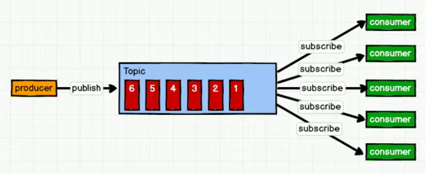
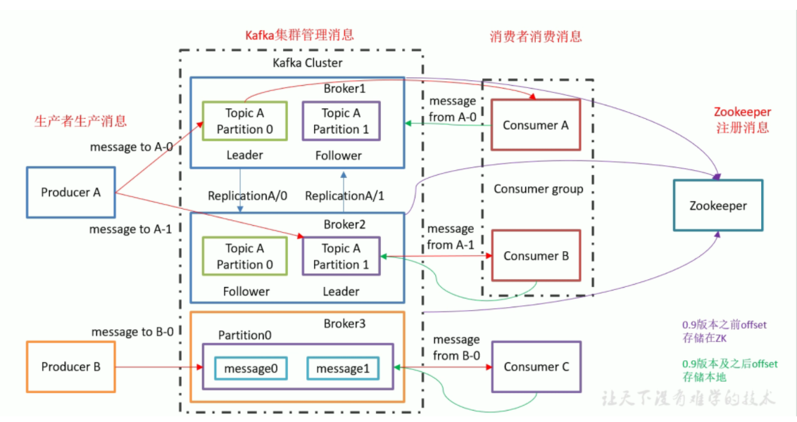
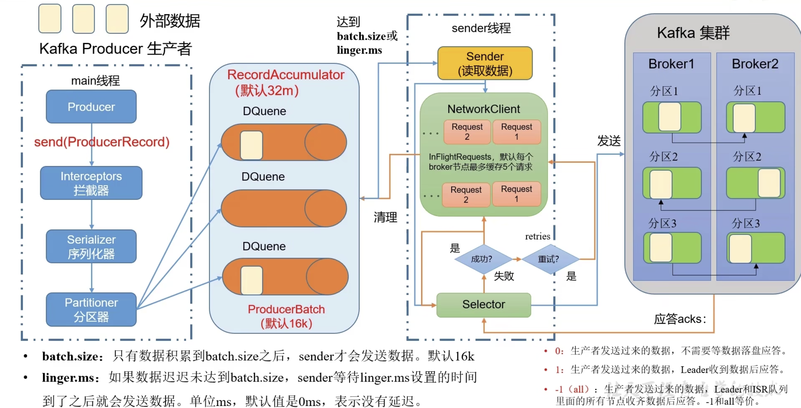
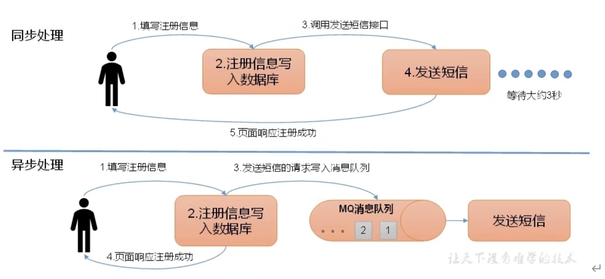
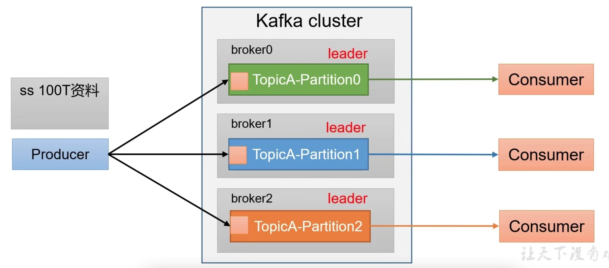
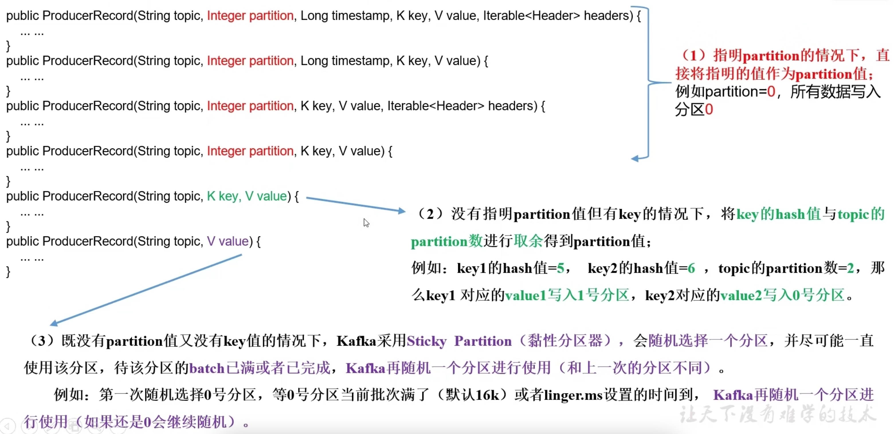

# 一、Kafka
## 1. Kafka概述
### 1.1 定义
Kafka是一个**分布式**的基于**发布/订阅模式**的消息队列
### 1.2 消息队列
> 点对点模式（一对一，消费者主动拉取数据，消息收到后消息清除）

	消息生产者生产消息发送到Queue中，然后消息消费者从Queue中取出并且消费消息。消息被消费以后，queue中不再有存储，所以消息消费者不可能消费到已经被消费的消息。Queue支持存在多个消费者，但是对于一个消息而言，只会有一个消费者可以消费。

> 发布/订阅模式（一对多，消费者消费数据之后不会清除消息）

消息生产者(发布)将消息发布到topic中，同时会有多个消息消费者（订阅）消费该消息。和点对点方式不同，发布到topic的消息会被所有订阅者消费。 

发布/订阅模式基于数据的同步方式分为两种：
1.消费者主动拉取数据（Kafka）
	优点：消费者消费的处理速度由自己决定 
	缺点：需要通过长轮循去判断是否有数据更新
2.消息队列推送数据（公众号)
	优点：消息推送及时
	缺点：对消费者自身的处理速度有一定要求
### 1.3 Kafka架构


- broker：代理，主要进行Kafka内部的消息转发，一个Kafka节点就是一个broker，一个或多个broker可以组成一个Kafka集群。
- topic：主题，消息主题，相当于是消息的分类，用于区分不同类型的消息。Kafka根据topic对消息进行归类，发布到Kafka集群的每条消息都需要指定一个topic。
- partition：分区，提高Kafka的并发能力。一个主题可以有不同的分区，不同分区互补影响。
- leader：主。
- foller：从，主的备份。
- consumer Group：消费者组，提高Kafka。同一个消费者组的消费者只能消费一个主题内的一个分区。一个主题有几个分区，那么该主题对应的消费者组就应该有几个消费者。避免资源浪费，并发利用率最高。
## 2. Kafka生产者
### 2.1 发送流程 
在消息发送过程中，涉及到两个线程——main线程和sender线程。在main线程中创建了一个双端队列RecordAccumulator。main线程将消息发送给RecordAccumulator，sender线程不断从RecordAccumulator中拉取消息发送到Kafka Broker。

### 2.2 异步发送
> 异步通信：允许用户把一个消息放入队列，但并不立即处理它，然后在需要的时候去处理它们。



---

> 普通异步发送api

```java
// 配置kafka
Properties properties = new Properties();
// 配置kafka地址
properties.put(ProducerConfig.BOOTSTRAP_SERVERS_CONFIG, "");
// 配置kafka key的序列化方式为string
properties.put(ProducerConfig.KEY_SERIALIZER_CLASS_CONFIG, StringSerializer.class.getName());
// 配置kafka value的序列化方式为String
properties.put(ProducerConfig.VALUE_SERIALIZER_CLASS_CONFIG, StringSerializer.class.getName());

// 1. 创建kafka对象
KafkaProducer<String, String> producer = new KafkaProducer<>(properties);
// 2. 发送数据
producer.send(new ProducerRecord<>("topic", "value"));
// 3.关闭资源
producer.close();
```

---

> 异步发送回调api

```java
// 配置kafka
Properties properties = new Properties();
// 配置kafka地址
properties.put(ProducerConfig.BOOTSTRAP_SERVERS_CONFIG, "");
// 配置kafka key的序列化方式为string
properties.put(ProducerConfig.KEY_SERIALIZER_CLASS_CONFIG, StringSerializer.class.getName());
// 配置kafka value的序列化方式为String
properties.put(ProducerConfig.VALUE_SERIALIZER_CLASS_CONFIG, StringSerializer.class.getName());

// 1. 创建kafka对象
KafkaProducer<String, String> producer = new KafkaProducer<>(properties);
// 2. 发送数据, 发送完成后处理回调函数
producer.send(new ProducerRecord<>("topic", "value"), (metadata, exception) -> {
  // 如果异常为null
  if (exception == null) {
    System.out.println("topic：" + metadata.topic() + "分区：" + metadata.partition());
  }
});
// 3.关闭资源
producer.close();
```
### 2.3 同步发送
```java
// 配置kafka
Properties properties = new Properties();
// 配置kafka地址
properties.put(ProducerConfig.BOOTSTRAP_SERVERS_CONFIG, "");
// 配置kafka key的序列化方式为string
properties.put(ProducerConfig.KEY_SERIALIZER_CLASS_CONFIG, StringSerializer.class.getName());
// 配置kafka value的序列化方式为String
properties.put(ProducerConfig.VALUE_SERIALIZER_CLASS_CONFIG, StringSerializer.class.getName());

// 1. 创建kafka对象
KafkaProducer<String, String> producer = new KafkaProducer<>(properties);
// 2. 同步发送数据，get方法获取kafka消息元数据
RecordMetadata recordMetadata = producer.send(new ProducerRecord<>("topic", "value")).get();
// 3.关闭资源
producer.close();
```
### 2.4 生产者分区
> 分区的好处

- 便于合理使用存储资源。每个Partition在一个broker上存储，可以把海量的数据按照分区切割成一块一块数据存储在多台broker上。合理控制分区的任务，可以实现**负载均衡**的效果。
- 提高并行度，生产者可以以分区为单位发送数据；消费者可以以分区为单位消费数据。



---

> 分区策略

分区的原则主要分为三种情况。ProducerRecord.class为生产消息的实体，通过其构造方法设置分区。


---

> 自定义分区器

1. 实现Partitioner接口
2. 配置自定义分区器
```java
/**
 * 自定义分区器
 *
 * @author chaizj
 * @date Created in 2022/8/21 12:19
 */
public class CustomPartitioner implements Partitioner {

    /**
     * 分区方法
     * @param topic 主题
     * @param key key
     * @param keyBytes 序列化后的key
     * @param value value
     * @param valueBytes 序列化后的value
     * @param cluster 当前集群元数据
     * @return 分区
     */
    @Override
    public int partition(String topic, Object key, byte[] keyBytes, Object value, byte[] valueBytes, Cluster cluster) {
        String s = value.toString();
        int partition;
        if(s.contains("hello")) {
            partition = 0;
        } else {
            partition = 1;
        }
        return partition;
    }
}

// 配置自定义分区器
properties.put(ProducerConfig.PARTITIONER_CLASS_CONFIG, "com.my.producer.CustomPartitioner");
```
### 2.5 生产问题
> 生产者如何提高吞吐量


---

> 数据可靠性


---

> 数据去重


---

> 数据有序


---

> 数据乱序


## 3. Kafka消费者
## 4. Kafka API
## 5. Kafka监控
