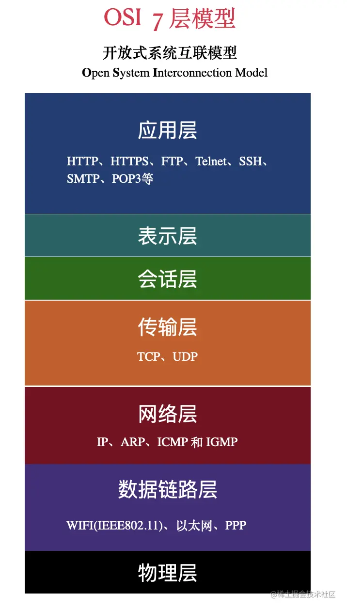
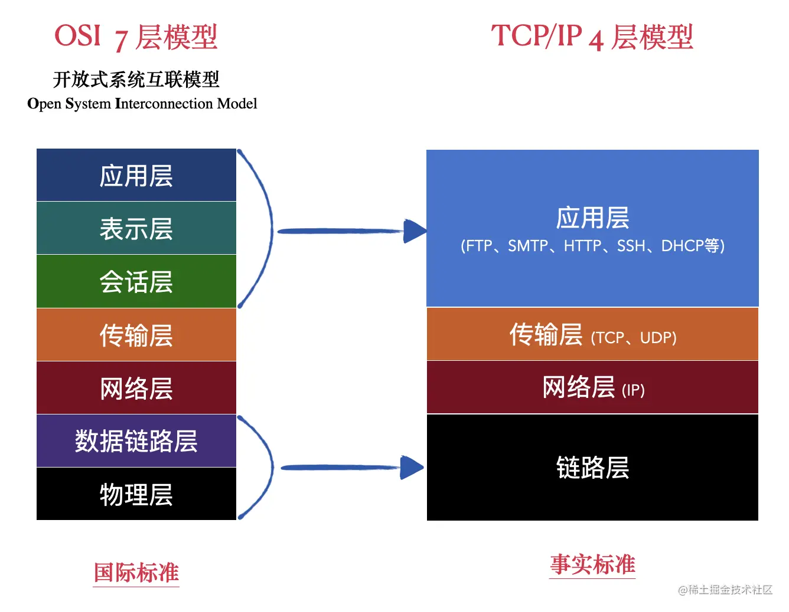
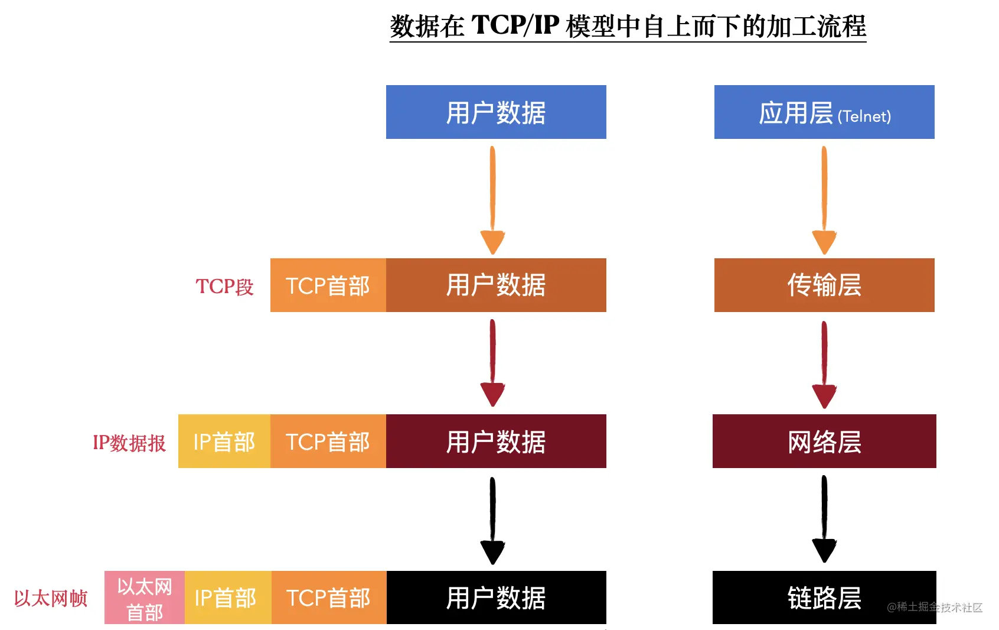
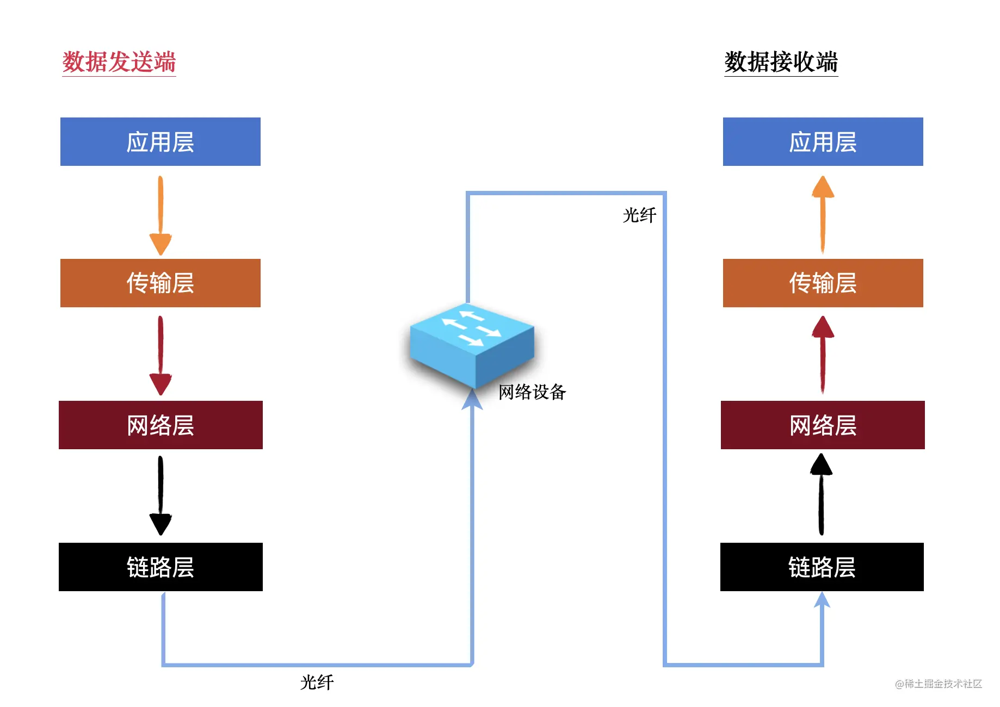
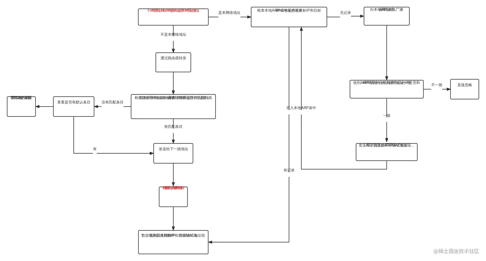

今天是轻解计算机网络系列第一解，从宏观上了解网络。主要介绍网络分成模型、基本传输过程。

学习任何一种新技术都应该是这样的顺序，先从宏观上了解这门技术的基本原理和作用。这就好像生物学家研究一种生物，不能上来就解刨吧，一定是从整体上观察了这种生物的体貌和形态。这里的宏观就像是一具动物骨骼模型、神经模型、肌肉模型，一直摆在那里，到最后装进科学家的脑袋里。

学技术切忌直接扣到一个细节里，扣细节，既可能是一丝不苟的工匠精神的提现，也可能直接被魔鬼代入深渊。我们是坐在天上的直升飞机找路比较容易，还是一头钻进一个胡同儿里比较容易呢。

今天要讲的网络模型，就像是生物学上的整体动物模型。

## 分层网络模型

为了让全世界的计算机有效的互联起来，就要制定标准，分层模型就是这种标准的定义，有了这种标准，全世界的软硬件开发者才能开发出通用的程序来，要不然就像现在的手机充电口，苹果就是要用它独特的雷电接口，我要是再有一部安卓手机，就要有两条充电线。

有两种网络模型，一种是 OSI 7层模型，还有一种是 TCP/IP 模型，前者是一种概念话的模型，后者是事实上的标准。事实标准也就是当今网络世界里普遍使用的模型。

### OSI 7层模型

国际标准化组织提出了一种概念化的网络模型，**开放式系统互联模型**（Open System Interconnection Model），简称 OSI 模型。

自上而下依次为应用层、表示层、会话层、传输层、网络层、数据链路层、物理层。

每一层都有一种或多种协议，这些协议都有标准的 RFC 文档，可以到[www.rfc-editor.org/retrieve/](https://link.juejin.cn?target=https%3A%2F%2Fwww.rfc-editor.org%2Fretrieve%2F "https://www.rfc-editor.org/retrieve/") 这里查看各个协议的最原始说明。

#### 应用层

应用层提供为应用软件而设计的接口，以设置与另一应用软件之间的通信。例如：HTTP、HTTPS、FTP、Telnet、SSH、SMTP、POP3等。

#### 表示层

表示层把数据转换为能与接收者的系统格式兼容并适合传输的格式。

#### 会话层

会话层负责在数据传输中设置和维护计算机网络中两台计算机之间的通信连接。

#### 传输层

传输层把传输表头（TH）加至数据以形成数据包。传输表头包含了所使用的协议等发送信息。例如:传输控制协议（TCP）等。

#### 网络层

网络层决定数据的路径选择和转寄，将网络表头（NH）加至数据包，以形成分组。网络表头包含了网络资料。例如:互联网协议（IP）等。

#### 数据链路层

数据链路层负责网络寻址、错误侦测和改错。当表头和表尾被加至数据包时，会形成信息框。数据链表头（DLH）是包含了物理地址和错误侦测及改错的方法。数据链表尾（DLT）是一串指示数据包末端的字符串。例如以太网、无线局域网（Wi-Fi）和通用分组无线服务（GPRS）等。

分为两个子层：逻辑链路控制（logical link control，LLC）子层和介质访问控制（Media access control，MAC）子层。

#### 物理层

物理层在局部局域网上传送数据帧，它负责管理电脑通信设备和网络媒体之间的互通。包括了针脚、电压、线缆规范、集线器、中继器、网卡、主机接口卡等。

OSI 模型是国际标准模型，是指导互联网模型的概念标准。而在实际的设计实现过程中，最后形成了 TCP/IP 四层模型结构。我们在平时的一些书籍、文章中最常看到的也是 4 层模型，而非7 层模型。

### TCP/IP 4层模型

TCP/IP 模型实际上并不单单指 TCP 和 IP，实际上这一个协议簇，还包含了其他的一些协议，比如 UDP、ICMP、IGMP 等。

TCP/IP 模型是事实上的标准模型，在 7 层模型的基础上将最上面三层的应用层、表示层、会话层统一为应用层，将数据链路层和物理层统一为链路层或者叫网络接口层。

实际应用中还是以 4 层模型为准，毕竟这才是事实上的标准。还有一种 5 层模型的说法，实际上就是把 7 层中的应用层、表示层、会话层合并为应用层，其他层保持不变。

#### 应用层

将7层模型中最上层的应用层、表示层、会话层合并。

应用层主要运行我们平时经常使用的一些应用，比如 FTP、SSH、SMTP、HTTP、Telnet，也是我们开发过程中经常会打交道的，比如 HTTP，HTTP 在传输层仍然使用的是 TCP 协议，但是将 TCP 的细节做了封装。

#### 传输层

传输层主要就是 TCP 和 UDP 这两个协议，负责将应用层的用户数据传输到目的端。

TCP 是有状态高可靠的的传输协议，有三次握手和重传机制最大程度上保证数据能够顺利的到达目的端。

UDP 协议是无状态的高性能的协议，因为它不保证数据能够顺利的到达目的端，所以不用三次握手建立连接，传一次，数据到不到就不管了。

其实从传输层开始，往下每一层都要负责将数据传输到目的端的一部分工作，只不过下面两层根据其特性和主要作用又分为了网络层和链路层。

#### 网络层

网络层最主要的协议就是 IP 协议，负责将上一层「传输层」过来的 TCP 包或 UDP 包封装成 IP 数据报。通过 IP 协议，根据 IP 地址可以定位到一个网络主机。

除了 IP 协议外，ICMP 协议、IGMP 协议也工作在网络层。

ARP 和 RARP 协议也认为工作在网络层。

### 链路层

将 7 层模型中的最底两层数据链路层和物理层合并为链路层。

链路层也叫做网络接口层，它由多种网络接口标准和对应的驱动程序组成。一般我们说的数据链路层都是以太网链路层。

## 数据发送和接收过程

### 数据包放封装和解封装过程

TCP/IP 模型每个层都有各自的功能和分工，当有用户数据想要发送给另一台设备的时候，数据自上而下，从应用层向链路层传递有一个复杂的过程。

以 Telnet 为例，Telnet 在传输层是使用 TCP 协议的。

数据从应用层进入，到达传输层，添加上 TCP首部，将数据加工成 TCP 段，称为 Segment。这是为了保证数据的可靠性。

接着数据到达网络层，在网络层使用 IP 协议，被添加上 IP 首部，将数据加工成 IP数据报，称为 datagram 。经过网络层 IP 协议的加工，指定目标地址和 MAC 地址，保证数据准确的发送到目标机器。

接着数据到达链路层，添加上以太网头部，将数据加工成以太网帧，称为 frame，包含了网卡等硬件相关的数据。

这就好比是一个工厂的流水线作业，每一层就像是一个流水线上的一个工人，零件到了每个工人那里，就在上面加一些东西，直到最后一个环节才变成成品。

无论是 Telnet 还是 HTTP，都至少涉及到两台设备才能称之为网络互连，那发送方有一个数据自应用层向底层链路层的加工过程，对应的，在数据接收方，有一个数据从链路层向应用层解析的过程。这中间可能经历了漫长的传输介质，比如光纤，还可能有若干了中间设备，比如路由器、交换机等等。要保证数据在这么复杂的网络环境中可靠、准确的发送到目标机器，就是靠的 TCP、IP、以太网协议精巧的设计。

通过上面的数据自上而下的加工流程图可以看出，无论网络层是不是用的 IP 协议，无论传输层用的是 TCP 还是 UDP ，最后的成品实际上就是一个以太网帧。

### 数据在网络上的传输过程

上面说了数据在发送端上经过层层加头封装，以及到达目的端经过层层去头解封装的过程。但数据包很少有机会是直接从发送端一步到达目的端的，大部分都要在纷繁复杂的网络世界中穿梭游走，最终一步步的到达目的端。

这里先不说域名的事儿。

在发送数据的时候，绝大多数的情况下发送端只知道目的端的 IP 和 接收端口，这也是传输层（TCP或 UDP）必须的，经过层层包装后，拿以太网来说，真正跑到网络上的数据最终必须是一个完整的以太网帧，而以太网帧中必须要用目的端的 MAC 地址。

当发送端开始组装数据的时候，首先会检查目的IP 和自身的IP 是否处在同一个网络中。计算方式就是用 IP 地址和子网掩码进行「与运算」。

如果得到的网络地址是一致的，说明在同一个网络中，这时发送端检查自己的 ARP 表中是否有目的 IP 对应的 MAC 地址。如果有的话，直接将 MAC 地址组装到以太网数据帧中，发送数据帧，数据就能被目的端顺利接收。如果ARP 表中不存在目的IP对应的 MAC 地址，则向本网络广播发送 ARP 请求，ARP 请求会带着目的IP地址，意思就是询问“谁的IP地址是这个，请回复你的MAC地址给我”，网络中的主机看到后，如果IP是自己的，就返回给发送端一个ARP回复，回复中带着自己的MAC地址，发送端拿到MAC地址后，先存入本地的ARP表，然后组装以太网帧，将数据发送。

如果得到的网络地址不一致，说明目的端不在本网络中，那就要通过各种路由器、交换机等中间设备了。要发送到其他网络，就要经过路由器，路由器中维护着一张路由表，主要存放网络、主机与下一跳的对应关系。例如下表这样：

目标

子网掩码

下一跳

网络接口

192.168.8.0

255.255.255.0

0.0.0.0

en0

0.0.0.0

0.0.0.0

192.168.8.1

en1

大致的意思就是如果收到一个数据报，在当前路由器的路由表中寻找，一般目标都是一个网络地址（标明一个子网），把具体数据包的IP地址和当前路由表的子网掩码进行与操作，如果得到的结果和路由表目标栏一直，就转发给这个表目的下一跳地址，从网络接口栏所记录的接口发出（也就是路由器上的网口）。

如果下一跳地址是0.0.0.0 ，表示这个目的IP地址就在当前网络中。那就不用路由器转发了，拿到目的IP的MAC地址，就可以直接发送了（获取MAC地址的方法，前面说过了，先查ARP表，没有的话，再用ARP广播请求获取）。

如果下一跳不是0.0.0.0，表示目的IP不是本网络的地址，就发给下一跳的地址。

如果在路由表中都没有找到匹配的目标网络，那就看有没有配置默认条目了，默认条目也就是目标是0.0.0.0的条目，表示任意的IP都可以通过此条目的下一跳（也就是默认网关）地址转发出去。

如果在路由表中没有找到任何匹配的目标网络，并且没有设置默认条目，那就直接将数据包丢弃，并返回一个 主机不可达的 ICMP 请求。

## 常用的几种协议

有几种协议是我们应该掌握的，这里大概介绍一下，后面会慢慢解刨。

### 应用层协议

**必须掌握**的是HTTP 协议以及与之对应的 HTTPS 协议。这是每一个开发人员必须掌握的协议，因为我们无时无刻不在用到它。

其他的 FTP、SMTP、SSH等协议，了解一下就好了。

### 传输层协议

**必须掌握**的是 TCP协议和 UDP 协议，HTTP使用的是 TCP 传输，以及各种RPC框架、中间件大部分都是包装了 TCP 协议的。

TCP 协议是有连接的可靠的传输协议，除非网络出现问题，可保证数据正常到达，因为有重传机制。UDP 是无连接的不可靠的传输协议，不保证数据能顺利达到，只要发出去就行了，没有重传机制等。

### 网络层协议

**必须掌握**的是 IP 协议，从上层传递下来的包，无论是 TCP 协议还是 UDP 协议，最终都会搭载到 IP 协议之上。

ARP 和 RARP 协议也算是网络层协议，这两个协议负责地址转换。

ARP 协议根据 IP 地址得到 MAC 地址，RARP 协议根据 MAC 地址得到 IP 地址。

### 链路层协议

拿以太网位列，链路层协议一般就是指以太网帧协议。

## 总结

1、 我们平时说的网络模型一般指的是四层模型，分别是应用层、传输层、网络层、链路层；

2、数据从应用层自顶而下，由应用层->传输层->网络层->链路层，经过每一层会搭载一个对应的协议，封装上对应的协议头信息，等到了目的端，再自底向上经过层层解封装，最终得到原始数据；

3、每一个层都有对应的协议，每一种协议都经过严密的设计，都有其特定的协议头和独特的功能特性；

4、除了这种软件结构上的设计外，数据包在网络世界中穿梭，还要经过各种各样的设备，比如路由器、交换机、集线器等等，一个数据包从发送端到接收端可能要经过多次的封装和解封装。
