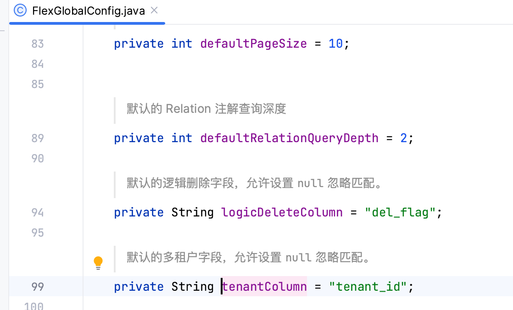

# 问题处理记录

## IDEA编译内存CPU100%，内存溢出

场景：项目中引入了新的依赖，原本可以运行的项目，却在编译过程中出现OOM，IDEA编译卡死，CPU飙升100%

解决错误：修改IDEA->File->Setting->Compiler->Shared build process heap size，从默认值700改为1024。

**shared build process heap size：共享构建进程堆大小**

"shared build process heap size"是IntelliJ IDEA中的一个设置，用于指定共享构建进程堆的大小。该设置用于优化IDE在构建过程中的性能，通过分配足够的内存来处理构建过程，以避免IDE崩溃或变得无响应。默认值通常对大多数项目来说已经足够，但可以根据项目的大小和复杂性进行调整。

## FeignClient

FeignClient注册重名的问题

## 方法引用

​`匿名内部类`​ -> `Lambda`​->`::`​

函数式接口

## JPS

查看所有Java进程，jps -l

## 多事务管理器配置

场景：项目中原本使用spring-jdbc作为持久层框架，后引入mybatis-flex后，原有事务失效，项目的事务管理器默认被修改为Flex的事务管理器

解决注册原本JDBC的事务管理器。

1. 配置JDBC事务管理器

    ```java
    @Configuration
    public class TransactionManagerConfig {

        @Autowired
        DataSource dataSource;

        @Bean
        DataSourceTransactionManager dataSourceTransactionManager() {
            return new DataSourceTransactionManager(dataSource);
        }
    }
    ```
2. 使用

    通过声明式事务指定本事务使用的事务管理器

    ```java
        @Transactional(rollbackFor = Exception.class, transactionManager = "dataSourceTransactionManager")
    ```

## 忽略租户条件

场景：mybatis-flex自动忽略tenant_id字段，导致更新时无法更新租户字段

​​

```java
// 源码	
	//租户ID 字段
	if ((column != null && column.tenantId())
		|| columnName.equals(config.getTenantColumn())) {
		if (tenantIdColumn == null) {
     		tenantIdColumn = columnName;
	} else {
 		throw FlexExceptions.wrap("The tenantId column of entity[%s] must be less then 2.", entityClass.getName());
	}
}

	// 解决 操作mapper时
        try {
            TenantManager.ignoreTenantCondition();
            //此处操作的数据不会带有 tenant_id 的条件
            return frSalItemSetMapper.update(frSalItemSet) > 0;
        } finally {
            TenantManager.restoreTenantCondition();
        }

```

## 递归函数与while处理

递归函数：适合处理单元化、标准化的程序，不依赖上下文执行。

while处理：while循环可以一直循环变量，使用场景无限制，依赖执行上下文的传递。

## 事务加锁

时机：在获取事务时开始加锁，而不是在执行SQL时。

## SQL的IN子句

在 SQL 中，`IN`​ 子句中如果重复列出相同的值，数据库系统通常会自动去重，只保留一个。这意味着对于重复的值，系统会将其视为一个唯一的值处理。

例如，如果你有以下查询：

```sql
SELECT * FROM some_table WHERE column_name IN ('value1', 'value2', 'value1');
```

数据库系统会自动将重复的 'value1' 去重，实际上查询会被处理为：

```sql
SELECT * FROM some_table WHERE column_name IN ('value1', 'value2');
```

因此，最终的查询结果不会受到重复值的影响，只会检索出满足条件的唯一值。

## Matcher.matches()

在 Java 中，`matcher.matches()`​ 是 `Matcher`​ 类的一个方法，用于检查整个输入字符串是否与给定的正则表达式完全匹配。

假设你有一个 `Pattern`​ 对象和一个输入字符串，你可以通过 `matcher()`​ 方法创建一个 `Matcher`​ 对象，然后使用 `matches()`​ 方法检查整个字符串是否匹配给定的正则表达式。

**没有调用** **​`matches()`​** ​ **方法，匹配就不会被执行。**​**​`matches()`​** ​ **方法实际上执行了整个字符串与正则表达式的匹配过程。**

## Mybatis一级缓存

首先是在双检锁的实现过程中，mybatis的两条一摸一样语句为什么第二条不执行。后续排查可能是mybatis的一级缓存导致不执行第二条SQL

解决办法是，通过更换mapper的接口名称使缓存的key不一致，就可以执行第二条SQL查询。

MyBatis 中的缓存机制是基于缓存键（Cache Key）的。每次查询的时候，MyBatis 会使用一个缓存键来查找是否已经有缓存的结果。缓存键的生成是根据以下几个因素：

1. **Mapped Statement 的 ID：**  即 SQL 语句的唯一标识符。
2. **Statement Type：**  SQL 语句的类型，包括 `SELECT`​、`UPDATE`​、`DELETE`​、`INSERT`​。
3. **SQL 语句的参数：**  SQL 语句的参数值，这些参数值会被用于生成缓存键。
4. **RowBounds：**  如果有使用 RowBounds 进行分页，RowBounds 也会用于生成缓存键。
5. **Environment ID：**  数据源的环境 ID。

这些因素一起构成了一个缓存键，用于在缓存中查找或存储结果。当 MyBatis 执行一个查询时，它会首先生成一个缓存键，然后使用这个缓存键在缓存中查找是否已经有对应的结果。如果找到了缓存的结果，MyBatis 将直接返回缓存的结果，而不执行实际的 SQL 查询。

这个缓存键的生成方式确保了不同的查询会生成不同的缓存键，以防止查询结果被错误地从缓存中返回。

需要注意的是，一级缓存是 SqlSession 级别的，而二级缓存是 Mapper 级别的。一级缓存的生命周期是与 SqlSession 相关的，而二级缓存的生命周期是与整个应用程序的 Mapper 相关的。

**需要注意的是，这与可重读的隔离级别是不一样的，可重复读是基于数据库的快照，而一级缓存仅仅是基于SQLSESSION的缓存。**

## SqlSession的坑

昨天线上出了一个问题，场景是有一个事务A，事务B，事务C。事务A包含事务B1和事务B2。采用`@Transactional`​默认的`Propagation.REQUIRED`​的隔离级别，当前隔离级别是如果存在事务就加入当前事务，若不存在事务，就新建事务执行。也就是说，

事务A以及事务B1以及事务B2都在一个大事务内。问题就来了，事务B2读取不到事务B1修改之后的值，直接就导致大事务A的数据产生错误。

事务B1以及事务B2的SQL为

```sql
-- SQL1
SELECT id, serial_no FROM COM_NO_SERIAL WHERE rule_id = '23e344f6206441dc8d2ae23197759e65' AND rule_format = 'YSPF-240308%s' FOR UPDATE

-- SQL2
UPDATE COM_NO_SERIAL SET serial_no = 2 , update_time = '2024-03-08 09:43:49'  WHERE id = '1d68eba2b64748cd953b16776ee0fb64'
```

按照数据库的事务来说，B1，B2都属于大事务A，A以及B1以及B2都在一个事务内，也同属一个SqlSession。B2肯定能获取到B1的更改。

由分析判断属于一个事务，那么在一个事务内依据数据库验证：隔离级别为：`read committed`​，事务提交方式修改为手动

```sql
-- 在事务未提交的情况下依次执行一下SQL

SELECT id, serial_no FROM COM_NO_SERIAL WHERE rule_id = '23e344f6206441dc8d2ae23197759e65' AND rule_format = 'YSPF-240308%s' FOR UPDATE;
-- '1d68eba2b64748cd953b16776ee0fb64', 2
UPDATE COM_NO_SERIAL SET serial_no = 3 , update_time = '2024-03-08 09:43:50'  WHERE id = '1d68eba2b64748cd953b16776ee0fb64'

SELECT id, serial_no FROM COM_NO_SERIAL WHERE rule_id = '23e344f6206441dc8d2ae23197759e65' AND rule_format = 'YSPF-240308%s' FOR UPDATE;
-- '1d68eba2b64748cd953b16776ee0fb64', 3
UPDATE COM_NO_SERIAL SET serial_no = 3 , update_time = '2024-03-08 09:43:50'  WHERE id = '1d68eba2b64748cd953b16776ee0fb64'
```

由以上结构证明在同一事物内，绝对是可以获取到自身事务修改后的数据的，无论当前事务是否提交。那么为什么在代码中，事务B2为啥读取不到B1的数据呢？下面编写单元测试验证，采用循环调用去查询与更新操作

```java
  	// 调用方  
	@Transactional(rollbackFor = Exception.class)
    public void testNo() {
		// 循环十次，相当于有十个事务加入到大事务中
        for (int i = 0; i < 10; i++) {
            String billNo = xxxService.executeService();
        }
    }

	// 业务方executeService();
	public String executeService() {
		// SQL1
    	XXX xxx = comNoSerialMapper.selectXXX(XXX, XXX);
		Long xxx = xxx.get() + 1L;
		// SQL2
	    UpdateChain.of(XXX.class)
			.set(XXX::xxx, xxx)
		    .set(XXX::UpdateTime, DateUtil.formatDate(new Date()))
		    .where(XXX::Id).eq(xxx.Id())
		    .update();
	}
```

通过单元测试的日志发现，SQL1只在首次执行了一次，后续的SQL日志都是SQL2的更新日志。为什么SQL1只在首次执行呢？

排查数据库的隔离级别，并且在同一事务内，那么应该就是**Mybatis的一级缓存问题。** 一级缓存是默认开启的，由于在同一个事务内，也就是同一个SqlSession会话内，肯定是会存在查询缓存的，并且只会查询一次

有两种解决方案：

1. 修改事务隔离级别：从默认的`required`​改为`required_new`​每次都新建一个事务执行。事务新建之后会自动提交，所以每次事务查询都会是从数据库获取的最新值。
2. 使一级缓存的失效：一级缓存默认会在同一会话进行增删改后失效。（下文再提及为什么执行了修改一级缓存也没有失效的问题）或者就是关闭默认的一级缓存。

**为什么执行了修改，SqlSession的一级缓存没有失效，仍然存在？**

通过业务代码可以看出，SQL2是通过工具类去更新，类似于直接SQL，这种可能就没有触发清除一级缓存。因为`mapper`​是代理对象在切面清理缓存，个人推测应该至少通过`mapper`​方式去执行更新的方式才能清除掉一级缓存，避免数据不一致。

## Redis哪些类型的key支持同时设置过期时间

在Redis中，只有字符串类型的键（String）支持同时设置过期时间。其他类型的键，如列表（List）、集合（Set）、有序集合（Sorted Set）、哈希（Hash）等，不支持直接设置过期时间。

‍
