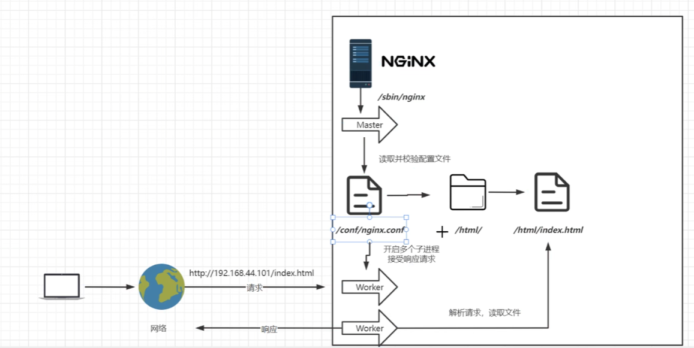

## 1. 常用版本
> 常用版本分为四大阵营

- Nginx开源版 [http://nginx.org/](http://nginx.org/)
- Nginx plus 商业版 [https://www.nginx.com](https://www.nginx.com)
- Openresty [http://openresty.org](http://openresty.org)
- Tengine [http://tengine.taobao.org/](http://tengine.taobao.org/)
## 2. nginx多进程协调
> nginx工作流程



1. nginx通过`/sbin/nginx`启动后，产生一个master进程，
2. master进程检查读取`/conf/nginx.conf`下的配置后，开启多个worker进程
3. master负责协调workder进行，workder负责处理请求。
> 通过`ps-ef|grep nginx`查询进程信息，可以看出有一个`worker process `和 `master process`


## 3. nginx基本使用
**3.1 配置解析**
```sql
worker_processes  1;# workder进程个数 一个cpu内核对应一个process

events { # 事件驱动模块
    worker_connections  1024; # 每个workder进程可以创建多少连接
}

http {
    include       mime.types; # 引入其他配置文件 mime.types记录的是http响应头类型
    default_type  application/octet-stream; # 默认的响应头类型    
    sendfile        on; # 数据0拷贝   
    keepalive_timeout  65; # 连接超时时间     
    server { # 主机
        listen       80; # 监听端口号
        server_name  localhost; # 主机名
        
        upstream javas { # 反向代理的一组上游服务 javas对应proxy_pass的java        
          server 192.168.93.101:80; # 一组集群服务          
          server 192.168.93.101:80;
        }
        
        location / { # uri
            proxy_pass http://javas  # 反向代理的服务地址 不能与root同时存在
            root   html; # uri指向的根目录
            index  index.html index.htm; # 默认页面
        }
        
        error_page   500 502 503 504  /50x.html; # 错误页面
        location = /50x.html {
            root   html;
        }        
    }
}
```
**3.2 Docker 安装Nginx**

1. 下载Nginx的docker镜像 `docker pull nginx:latest`
2. 从容器中拷贝nginx配置
> 先运行一次容器（为了拷贝配置文件）

```shell
docker run -p 80:80 --name nginx \
-v /home/nginx/html:/usr/share/nginx/html \
-v /home/nginx/logs:/var/log/nginx  \
-d nginx:latest
```
> 将容器内的配置文件拷贝到指定目录 

```shell
docker container cp nginx:/etc/nginx /home/nginx/conf
```
> 终止并删除容器

```shell
docker stop nginx
docker rm nginx
```

3. 使用docker命令启动
```shell
docker run -p 80:80 --name nginx \
-v /home/nginx/html:/usr/share/nginx/html \
-v /home/nginx/logs:/var/log/nginx  \
-v /home/nginx/conf:/etc/nginx \
-d nginx:latest
```
