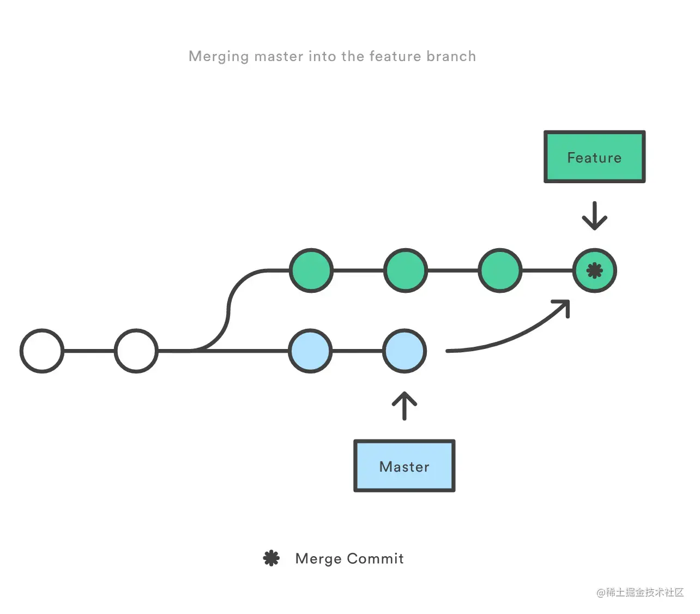
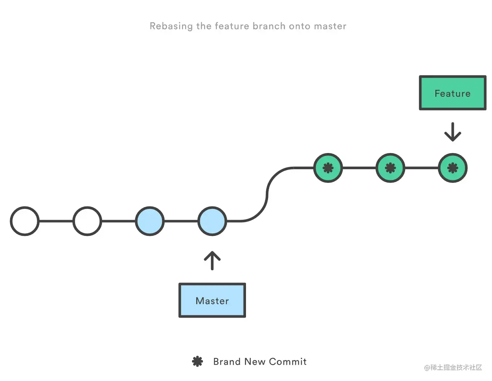
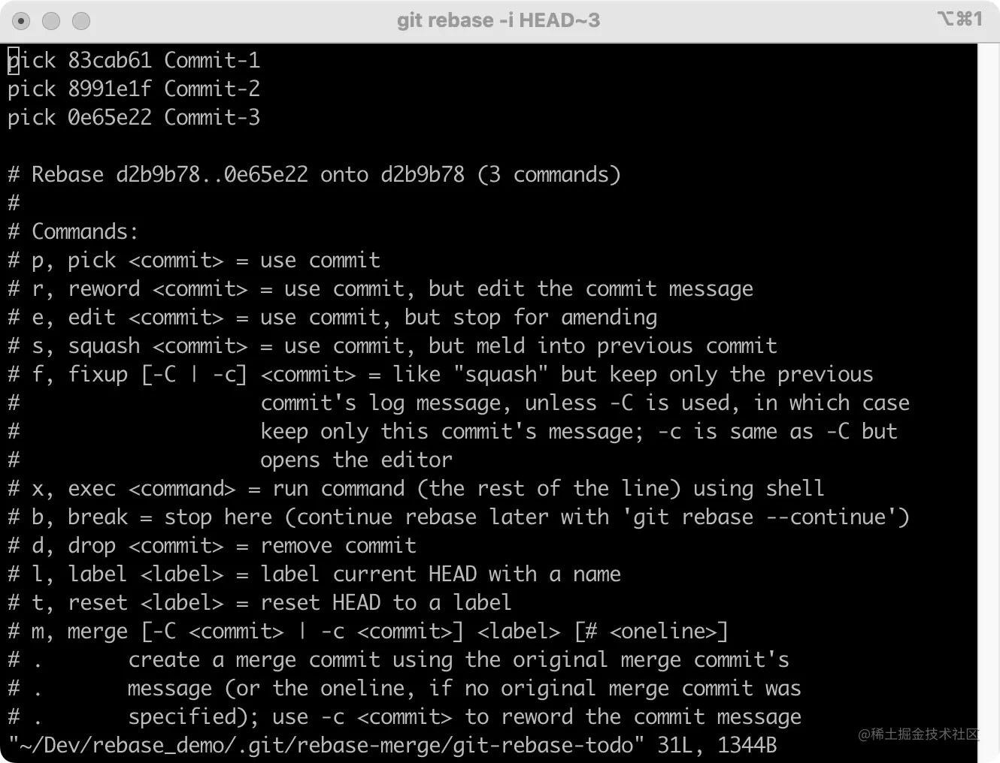

## 前言

笔者最近在主导一个项目的架构迁移工作，由于迁移项目的历史包袱较重，人员合作较多，在迁移过程中免不了进行多分支、多次commit的情况，时间一长，git的提交记录便混乱不堪，随便截一个图形化的git提交历史给大家感受一下。


各种分支疯狂打架宛如后宫争宠的妃子们，之所以会出现这种情况，主要还是因为滥用git merge命令并且不考虑后续的理解成本导致的。如今在大厂工作的程序员们，频繁接受变更的需求，一旦一开始考虑不周到，就一定会出现了大量无意义的commit log，加上“敏捷”理念的推广，产品的快速迭代上线变成了核心指标，这些无意义的commit log便被“下次再处理”，久而久之就混乱不堪了。

而我们在看一些开源仓库时，会发现他们的commit记录十分整洁，其实这并不是社区的程序员能力更强，而是因为他们没有KPI大棒的鞭笞，在提交代码前会花时间整理自己的commit log。而这就是本文的主角了——“Git Rebase”。

## git rebase和git merge

git rebase，中文翻译为“变基”，通常用于分支合并。既然提到了分支合并，那就一定离不开`git merge`这个命令。

相信每个新手程序员刚进入职场的时候，都会听到“xxx你把这个分支merge一下”这样的话。那么问题来了，假如你有6个程序员一起工作， 你就会有6个程序员的分支， 如果你使用merge, 你的代码历史树就会有六个branch跟这个主的branch交织在一起。



上图是 `git merge` 操作的流程示意图，Merge命令会保留所有commit的历史时间。每个人对代码的提交是各式各样的。尽管这些时间对于程序本身并没有任何意义。但是merge的命令初衷就是为了保留这些时间不被修改。于是也就形成了以merge时间为基准的网状历史结构。每个分支上都会继续保留各自的代码记录，主分支上只保留merge的历史记录。子分支随时都有可能被删除。子分子删除以后，你能够看到的记录也就是，merge某branch到某branch上了。这个历史记录描述基本上是没有意义的。

而 `git rebase` 中文翻译为“变基”，变得这个基指的是基准。如何理解这个基准呢？我们看一下下图。



我们可以看到经过变基后的feature分支的基准分支发生了变化，变成了最新的master。这就是所谓的“变基”。

通过上面的两张图可以很明显的发现，这两种合并分支的方式最大的区别在于，merge后的分支，会保留两个分支的操作记录，这在git commit log 树中会以交叉的形式保存。而rebase后的分支会基于最新的master分支，从而不会形成分叉，自始至终都是一条干净的直线。

> 关于 `git rebase` 和 `git merge` 的详细用法不在本文的介绍范围内，详情可以参考互联网上的其他资料。

在变基过程中，我们通常需要进行commit的修改，而这也为我们整理git记录提供了一个可选方案。

## 保持最近的几条记录整洁

假设我们有一个仓库，我在这个仓库里执行了4次提交，通过 `git reflog` 命令查看提交记录如下。


如果我们想将Commit-3、Commit-2和Commit-1的提交合并成一次提交（假设某次提交至改了一些pom文件），我们可以直接执行下面的命令

```
git rebase -i HEAD~3
复制代码
```

`-i` 指的是 `--interactive` ，`HEAD~3` 指的是最近三次commit。

当然我们也可以直接指定**最新的一个想保留的 Commit**的ID，在上面的例子中就是Commit-0的ID，因此我们也可以写成

```
git rebase -i d2b9b78
复制代码
```

执行该命令后，我们会进入到这么如下一个界面：



这个界面是一个Vim界面，我们可以在这个界面中查看、编辑变更记录。有关Vim的操作，可以看我之前写的文章和录制的视频👉[《和Vim的初次见面》](https://link.juejin.cn/?target=https%3A%2F%2Fmp.weixin.qq.com%2Fs%2FaHg6t4KbMem5-1oIRyWHNQ "https://mp.weixin.qq.com/s/aHg6t4KbMem5-1oIRyWHNQ")

在看前三行之前，我们先来看一下第5行的命令加深一下我们对`git rebase`的认识。


翻译过来就是，将`d2b9b78..0e65e22`这几个分支变基到`d2b9b78`这个分支，也就是将`Commit-3/2/1/0`这几次变更合并到`Commit-0`上。

回到前面三行，这三行表示的是我们需要操作的三个 Commit，每行最前面的是对该 Commit 操作的 Command。而每个命令指的是什么，命令行里都已经详细的告诉我们了。


-   `pick`：使用该commit
-   `squash`：使用该 Commit，但会被合并到前一个 Commit 当中
-   `fixup`：就像 `squash` 那样，但会抛弃这个 Commit 的 Commit message

因此我们可以直接改成下面这样


> 这里使用fixup，而不是squash的主要原因是squash会让你再输入一遍commit的log，图省事的话，可以无脑选择fixup模式。

然后执行`:wq`退出vim编辑器，我们可以看到控制台已经输出Successful了。


这个时候我们再来看下log 记录，执行`git log --oneline`

于是最近三次的提交记录就被合并成一条提交记录了。

### 保持中间某些记录整洁

那如果不是最后的几个commit合并，而是中间连续的几个Commit记录，可以用上述方法整理合并吗？答案是可以的，只不过需要注意一下。

我们重新创建一个新的仓库


如果这次我们想将"third commit"和"second commit"合并为一个提交，其实和上面的方式一样，我们只需执行`git rebase -i HEAD~3`，然后将中间的提交改成`fixup/squash`模式即可，如下图所示：


> 之所以是HEAD~3，是因为我们要做的变更是基于first commit做的，因此我们也可以写成`git rebase -i a1f3929`

我们来看下更改完的commit log，如下图所示：


是不是就干掉了third commit了。

## 三行代码让git提交记录保持整洁

上面我们都是在本地的git仓库中进行的commit记录整理，但是在实际的开发过程中，我们基本上都是写完就直接push到远程仓库了，那应该如何让远程的开发分支也保持记录的整洁呢？

第一种做法是在push代码前就做在本地整理好自己的代码，但是这种做法并不适用于那种本地无法部署，需要部署到远程环境才能调试的场景。

这时我们只需要执行`git push -f`命令，将自己的修改同步到远程分支即可。

`-f`是force强制的意思，之所以要强制推送是因为本地分支的变更和远程分支出现了分歧，需要用本地的变更覆盖远程的。

而远程分支更新后，如果其他人也在这条分支上更改的话，还需要执行一个`git pull`命令来同步远程分支。

这里我们来总结下让git提交记录保持整洁的三行代码。

```
git rebase -i xxx
git push -f
git pull
复制代码
```

> ❗️❗️❗️Tips：由于rebase和push -f是有些危险的操作，因此只建议在自己的分支上执行哦。