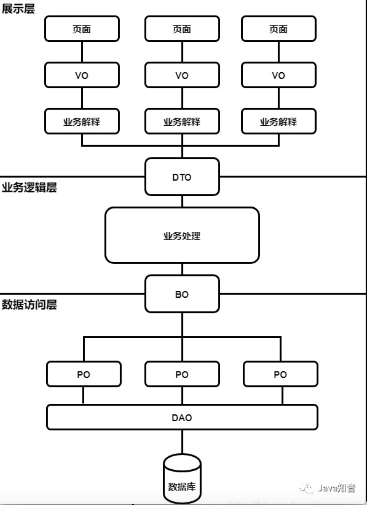

## 1.概念

- VO（`View Object`）：**视图对象**，用于展示层，它的作用是把某个指定页面（或组件）的所有数据封装起来。
- DTO（`Data Transfer Object`）：**数据传输对象**，这个概念来源于J2EE的设计模式，原来的目的是为了EJB的分布式应用提供粗粒度的数据实体，以减少分布式调用的次数，从而提高分布式调用的性能和降低网络负载，但在这里，更符合泛指用于展示层与服务层之间的数据传输对象。
- BO（`Business Object`）：**业务对象**，把业务逻辑封装为一个对象，这个对象可以包括一个或多个其它的对象。
- PO（`Persistent Object`）：**持久化对象**，它跟持久层（通常是关系型数据库）的数据结构形成一一对应的映射关系，如果持久层是关系型数据库，那么，数据表中的每个字段（或若干个）就对应PO的一个（或若干个）属性。
- DO（`Domain Object`）：**领域对象**，就是从现实世界中抽象出来的有形或无形的业务实体。

> VO和DTO

首先VO是最常用的，但对于这个概念，网上也是众说纷纭，value object 或 view object，一般说视图对象或者值对象，我更倾向理解为视图对象。说白了它就是展示用的，不管展示方式是网页，还是客户端，还是APP，只要是这个东西是让人看到的，我们就把它封装为VO。

VO比较容易混淆的是DTO，DTO是展示层与服务层之间传递数据的对象，可以这样说，对于绝大部分的应用场景来说，DTO和VO的属性值基本是一致的，而且他们通常都是POJO，那么既然有了VO，为什么还需要DTO呢?

**我们来举例说明一下：**

某公司有一个后台服务，服务层有一个getUser的方法返回一个系统用户，包含sex(性别)、年龄。对于服务层来说，DTO只从语义上定义，可能是这样的：

```json
{
 "gender":"男",
 "age":35
}
```

但这个服务同时供多个客户端使用（不同门户），而不同的客户端对于表现层的要求有所不同，比如管理端要求显示准确的年龄，而应用端为了保护客户隐私，只需要显示一个年龄段即可。

管理端VO：

```json
{
 "gender":"男",
 "age":35
}
```

应用端VO：

```json
{
 "gender":"男",
 "age":30~40
}
```

从这个例子可以看出，DTO很有存在的必要，根据职责单一原则，服务层只负责业务，与具体的表现形式无关，DTO不应该出现与表现形式的耦合，DTO定义的是原始数据，VO再对DTO数据进行解释。这下VO和DTO用法就清晰很多了。

> BO和PO

PO是持久对象，这个很好理解，就是实体和数据库字段的对应，一个PO的数据结构对应着库中表的结构，表中的一条记录就是一个PO属性，大多数情况下，PO仅仅作为PO只是用来增删改使用。

PO比较容易混淆的是BO，BO是业务对象，对应的是某个具体的业务块，可以包含多个属性、对象。简单点来说，我们可以把BO看作是PO的组合。

**我们举例来说明一下：**

PO-1是交易记录对象，PO-2是登录记录对象，PO-3是商品浏览记录对象，PO-4是添加购物车记录对象，PO-5是搜索记录对象，BO是个人网站行为对象，BO对象：{PO-1;PO-2;PO-3;PO-4;PO-5}。这样做的优点不言而喻，维护代码的时候查看BO，就能知道这块逻辑涉及多少表（PO）。

> BO和DTO

搞清楚了BO和PO各自的用途后，我们会发现BO和DTO有重叠功能，一样可以对PO进行排列组合，那BO的存在的意义是什么呢？

从用途上进行根本的区别，BO是业务对象，DTO是数据传输对象，虽然BO也可以排列组合数据，但它的功能是对内的，比如上个例子中的BO对象包括{PO-1;PO-2;PO-3;PO-4;PO-5}还有其他字段属性，但在提供对外接口时，BO对象中的某些属性对象可能用不到或者不方便对外暴露，那么此时DTO只需要在BO的基础上，抽取自己需要的数据，然后对外提供。

在这个关系上，通常不会有数据内容的变化，内容变化要么在BO内部业务计算的时候完成，要么在解释VO的时候完成。

> DO

DO是领域对象，就是从现实世界中抽象出来的有形或无形的业务实体。事实上，DO和PO在绝大部分情况下是一一对应的。阿里巴巴的开发手册中的定义DO等同于PO，即与数据库表结构一一对应，通过DAO层向上传输数据源对象。

---

上一张图，更加直观的展示这些名词使用的节点：



### 总结

VO，BO，PO，DTO这样分层还是很有意义的。尤其在团队成员较多的情况下，结构更加一目了然，同时也能很大程度避免多端系统数据所需不一致时，有人修改属性影响其他页面。但也完全没有必要教条主义，把这些全部用上，需要根据所开发的业务复杂度来取舍，如果本身业务逻辑不负责，照搬全上反而让开发变的更复杂。

例如业务不复杂，根本没有多端展示的差异化，VO可以直接拿掉，直接使用DTO传输到前端数据即可。

同时在使用过程中，最重要的是要在团队中达成共识，概念一致，如果使用了这些，但各按各的理解来，甚至抓起来就直接用，反而会让代码变得更乱，还不如直接POJO、DTO打天下。

另附这些概念命名规范：

- 数据对象：xxxPO，xxx即为数据表名。(也可DO)
- 数据传输对象：xxxDTO，xxx为业务领域相关的名称。
- 展示对象：xxxVO，xxx一般为网页名称。
- 业务对象：xxxBO，xxx是业务名称。